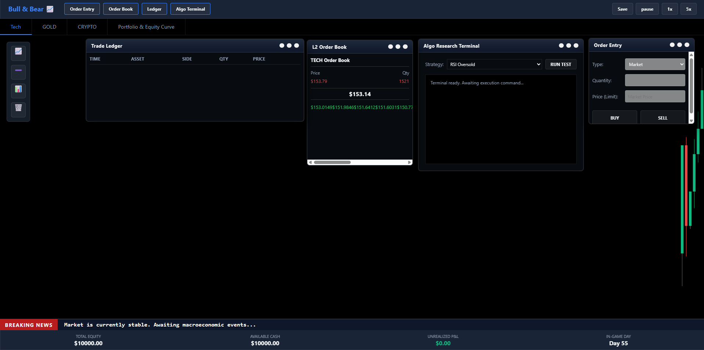
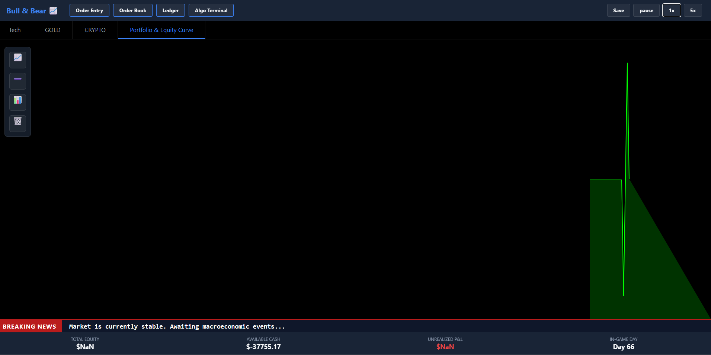

# Bull & Bear 📈

So i am a Commerce/NerdyTech Guy who finished his 12th with commerce as a stream, this is a basic stock market simulator with asic features, u can trade 3 stuff in this Tech, Gold, Crypto. i always leaned towards these terminals so i made this just a basic vanilla js and canvas based system that works great

**Try This Here** [https://fbiopeningupp.github.io/bull-and-bear/]

> Open the ALGO TERMINAL window and hit RUN to simulate 10 years of trading in ms!

# ScreenShots
### Main Page

### Portfolio and Equity Curve

# How to use
- click the top bar buttons so u can spawn windowws that are mentioned
- click the asset tab to switch between tech, gold, and crypto markets
- u can use the floating toolbar to use the drawing tools like trendlines and fibonaci levels in the live candels
- drag and resize the windows if u want to make them smaller or bigger
- u can hit play and paise and 1x and 5x so u can go faster or go slower

# how it works
- so the os layer handles the z indexing thing which is basically using mouse realtime cords for window movement 
- canvas engine which uses with math so it can autoscale all the candles
- drawing engine so u can draw peacefully (nothing to say a lot)
- fibonacci tool so it calcs all the distances between the 2 clicks and it draws the horizontal support zones at exact golden ratios
- idk really know what to explore more

## built with
- Vanilla JS
- html5 canvas api
- indexeddb
- pure css

# ai usage 
used ai to help write rendering code for the candle stick and debut the math thing so the coordinate mapping is done properly. and a bit of help in ui design
